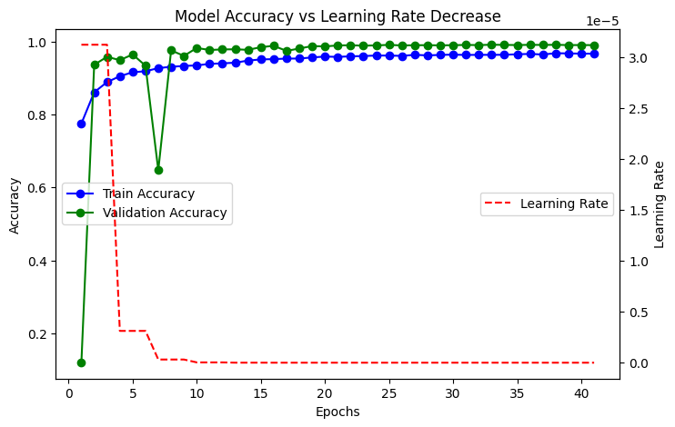
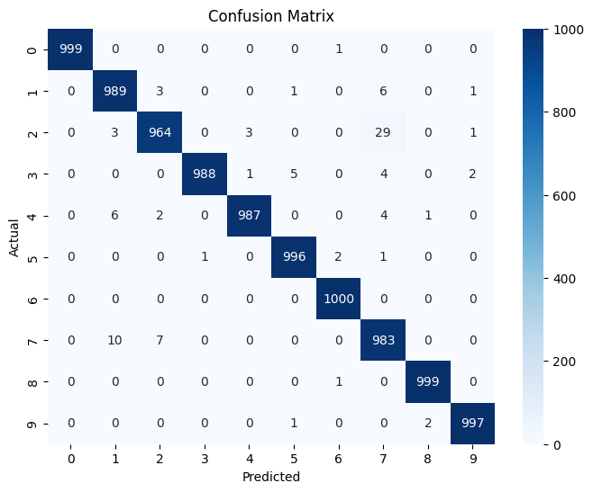

# ✍️ Handwritten Digit Classification with Custom CNN

Welcome to the **Handwritten Digit Classification** project!  
In this repository, we build a **custom Convolutional Neural Network (CNN)** to classify handwritten digits (0–9) with high precision.  
Achieved an impressive **99% accuracy** after training for 50 epochs! 🚀

### **Kaggle Notebook 🗒️ Link**: https://www.kaggle.com/code/jeet047/handwritten-digit-classification

## 🧠 Model Details

- Designed a **Custom CNN architecture** tailored for handwritten digit recognition.
- **Learning Rate Scheduler** used to dynamically adjust the learning rate during training for better convergence. 📈
- **Training** run for **50 epochs**.
- **Achieved Accuracy**: ~99% on the test set! ✅

## Results
**Accuracy and Learning Rate Graph over epochs**  

#### **Confusion Matrix**

