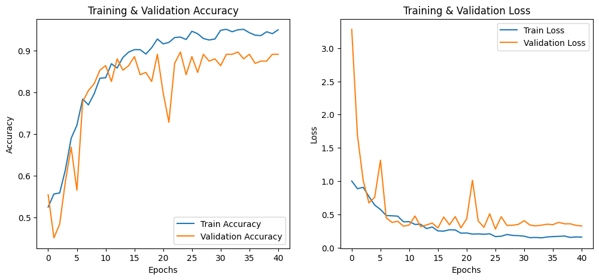

# 🦷 Oral Cancer Classification using Fine-Tuned VGG16

Welcome to the **Oral Cancer Classification** project!  
This repository contains a deep learning pipeline that classifies oral tissue images into **cancerous** and **normal** categories using a **fine-tuned VGG16** model.  
Achieved a solid **85% accuracy** on the validation set! 🚀

### **Kaggle Notebook 🗒️ Link**: https://www.kaggle.com/code/jeet047/oral-cancer-classification-using-fine-tuned-vgg16

## 🧠 Model Architecture

- Base model: **VGG16** 🏆
- Fine-tuning:
  - Initial convolutional layers **frozen** to retain general features.
  - Deeper layers **unfrozen and retrained** on oral cancer data.
  - Added custom **Dense layers** for binary classification.

## 📈 Results

- ✅ **Accuracy**: ~85%
- ✅ **Loss minimization** through fine-tuning
- ✅ **Better generalization** to unseen images
- 

**Accuracy & Loss graph 📈 over epochs** 
