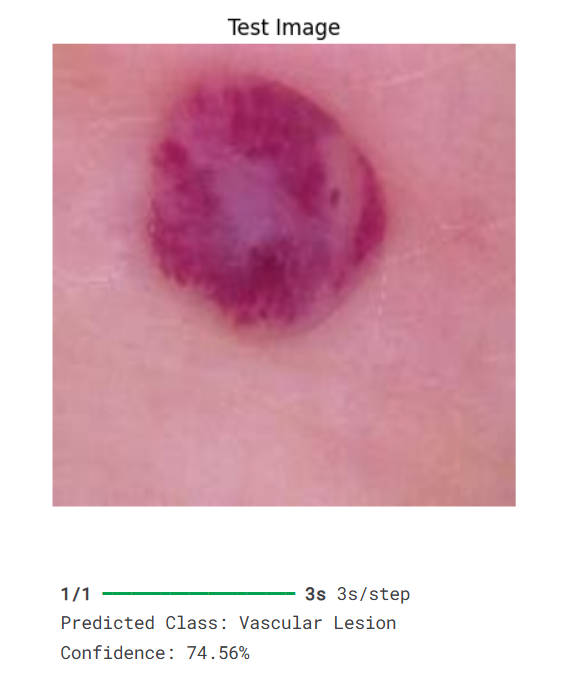
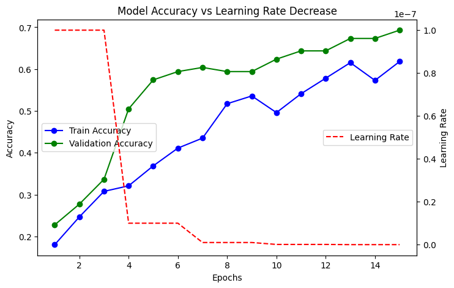

# 🩺 Skin Disease Detection using MobileNetV2

Welcome to the **Skin Disease Detection** project!  
This repository contains a complete deep learning pipeline to classify various skin diseases using a **fine-tuned MobileNetV2** model.  
The model is trained carefully in **three progressive phases** to achieve strong performance and generalization! 🚀

### Kaggle Notebook Link: https://www.kaggle.com/code/jeet047/skin-disease-detection-using-mobilenetv2

## 🧠 Model Workflow

- 📦 **Base Model**: Pre-trained **MobileNetV2** on ImageNet.
- 🧊 **Phase 1**: Train only the new classification head with all base layers **frozen**.
- 🔓 **Phase 2**: Unfreeze **some deeper layers** and fine-tune.
- 🔥 **Phase 3**: Unfreeze **more layers** for deeper fine-tuning.
- 🎯 **Learning Rate Scheduler** dynamically adjusts learning rates during training for smoother convergence.

## 📈 Results

- ✅ High accuracy and excellent generalization across phases.
- ✅ Robust feature extraction with MobileNetV2.
- ✅ Efficient training with minimal overfitting.

### **Model Tetsting with new image**

### **Accuracy and Learning rate Graph over epochs**

